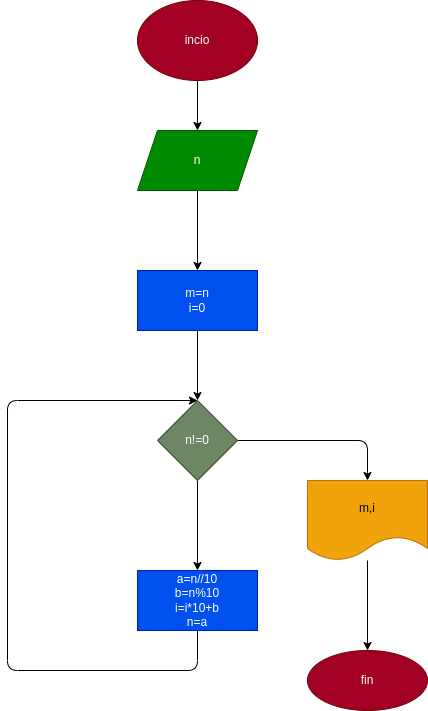

# inversa_numero
## Realizar un programa y su debido diagrama de flujo que lea un numero n entero y positivo de cualquier numero de digitos que calcule la inversa de sus digitos y la imprime junto con el numero leido
## Diagrama de flujo

